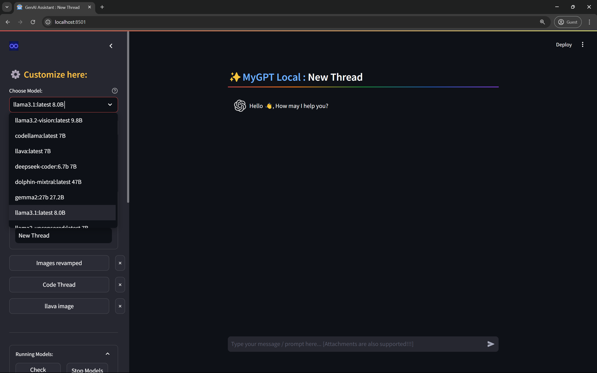
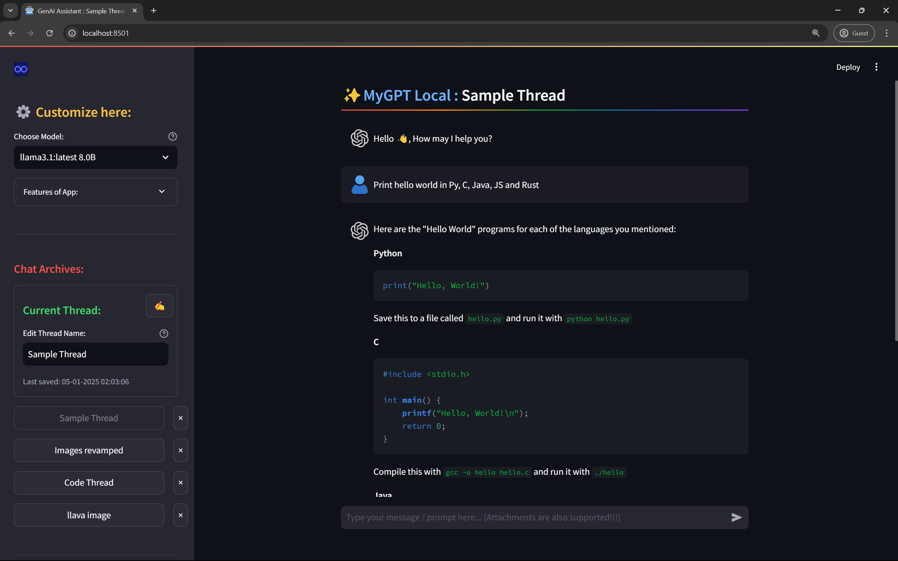
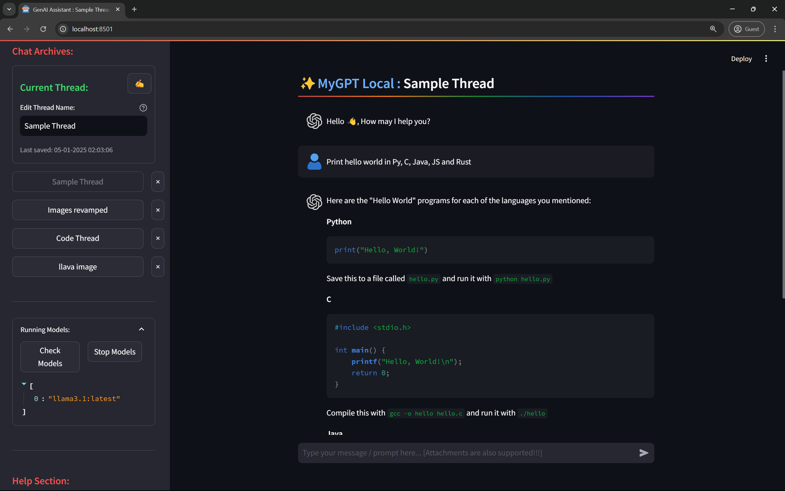
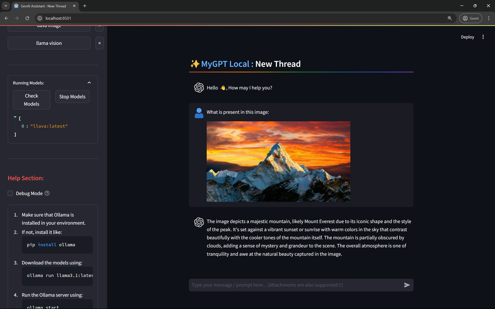

# ✨ LocalGPT
- Clone of ChatGPT to get same functionality using open source LLMs offline, locally.
- Gives interface to interact with LLMs installed locally via Ollama and Streamlit.

## Index:
- [LocalGPT](#localgpt)
- [Project Details](#project-details)
    - [Aim](#aim)
    - [Features](#features)
    - [Tech Stack](#tech-stack)
    - [Screenshots](#screenshots)
- [Steps to run](#steps-to-run)
- [Contributions](#contributions)
- [License](#license)
- [Contact](#contact)


## Project Details:
### Aim:
To provide an interface to interact with LLMs installed locally, offline, and to save the threads and models used for later use.

### Features:
- Runs Locally with Streamlit
- Any model from Ollama can be used
- Supports Streaming Responses with Live Preview
- Support attachments like Images for vision models like LLama Vision and LLava
- Supports Threads (Chat Archives)
- Can rename, create and delete threads
- Threads are listed as per last used
- Remembers the last model used with thread, which is auto-loaded next time
- Can switch between models within same thread
- Running models can be checked and stopped

### Tech Stack:
- Python
- Streamlit
- Ollama

### Screenshots:
- **Home Page:**
    
- **Sample Prompt:**
    
- **Running Models:**
    
- **Image support:**
    

## Steps to run:

1. Clone the repository:
    ```bash
    git clone https://github.com/Bbs1412/LocalGPT
    ```
    
1. Navigate to the project directory:
    ```bash
    cd LocalGPT
    ```

1. Install the required packages:
    ```bash
    pip install -r requirements.txt
    ```

1. Run the app:
    ```bash
    streamlit run app.py
    ```

1. Open the link in the browser:
    ```bash
    http://localhost:8501
    ```


## Contributions:
   Any contributions or suggestions are welcome! 


## License: 

- This project is licensed under the `MIT License`
- See the [LICENSE](LICENSE) file for details.
- You can use the code with proper credits to the author.


## Contact:
- **Email -** [bhushanbsongire@gmail.com](mailto:bhushanbsongire@gmail.com)
- **LinkedIn -** [/bhushan-songire](https://www.linkedin.com/in/bhushan-songire/)